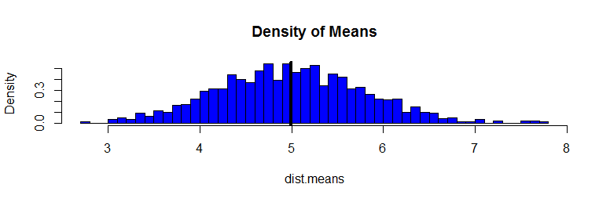
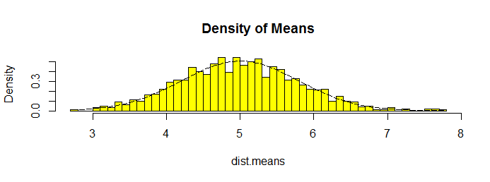
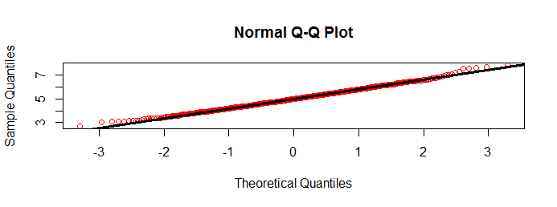

---
#Title: Statistical Inference
##ProjectPart 1: Simulation using the exponential distribution
###Author: Madhavi Pullela 
####Date: 2017-02-04
####Output: pdf_document


```{r setup, include=FALSE}
knitr::opts_chunk$set(echo = TRUE)
```


##Objective : 

In this project we will investigate the exponential distribution in R and compare it with the Central Limit Theorem. The exponential distribution can be simulated in R with rexp(n, lambda) where lambda is the rate parameter.
The mean of exponential distribution is 1/lambda and the standard deviation is also 1/lambda.
Set lambda = 0.2 for all of the simulations. 
We will investigate the distribution of averages of 40 exponentials and for that we will need to do a thousand simulatted averages of 40 exponentials. 

We will 

1. Show the sample mean and compare it to the theoretical mean of the distribution.
2. Show how variable the sample is (via variance) and compare it to the theoretical variance of the distribution.
3. Show that the distribution is approximately normal.

```
load: ggplot2
```

Set and get the means of 1000 Simulations

```r
set.seed(9867)    ## Ensure reproducibility
n <- 1000         ## Number of runs
sample.size <- 40 ## 40 samples in each run
lambda <- 0.2     ## Variable input./Question3a.png
dist <- matrix(rexp(sample.size*n, rate=lambda), ncol = sample.size, nrow=n)
dist.means <- rowMeans(dist) ##a  vector of n length with averages in each row based on sample size means
```

###1.Show the sample mean and compare it to the theoretical mean of the distribution.

```r
hist(dist.means,breaks=sample.size,prob=T,col="blue",main="Density of Means",ylab="Density")
abline(v=mean(dist.means),col="black",lwd=4)
```

 

```r
center.ac <- mean(dist.means)
center.th <- 1/lambda
```

The Theoretical center of the distribution is calculated as $1/\lambda$ = 1/0.2 = 5. The center of the distribution is 4.9951. The black line in the above plot displays the center.


###2.Show how variable the sample is (via variance) and compare it to the theoretical variance of the distribution.

```r
sd.ac <- sd(dist.means)
sd.th <- (1/lambda)*(1/sqrt(sample.size))

var.ac <- sd.ac^2 ## = var(dist.means)
var.th <-((1/lambda)*(1/sqrt(sample.size)))^2
```

Standard Deviation of the distribution is 0.7985 with the theoretical SD calculated as 0.7906.
The Theoretical variance is calculated as $(\frac{1}{\lambda} * \frac{1}{\sqrt{n}})^2$ = 0.625. Actual variance of the distribution is 0.6376.


###3. Show that the distribution is approximately normal.

```r
xfit <- seq(min(dist.means), max(dist.means), length=100)
yfit <- dnorm(xfit, mean=1/lambda, sd=(1/lambda/sqrt(sample.size)))
hist(dist.means,breaks=sample.size,prob=T,col="yellow",main="Density of Means",ylab="Density")
lines(xfit, yfit, pch=22, col="black", lty=5)
```

 


 

As per the first plot we have overlayed a normal distribution (in black) over the density plot taken from the means of the exponential distribution. To confirm the same, we used a qqnorm plot to distribute and overlay the theoretical line.
We can observe on the QQ-plot that most of the red is on the theoretical normal line and only deviates at the begging and end due to the skewness of the exponential distribution.


